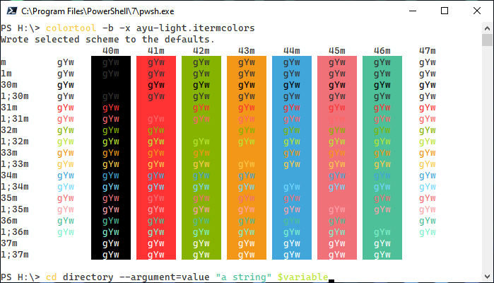
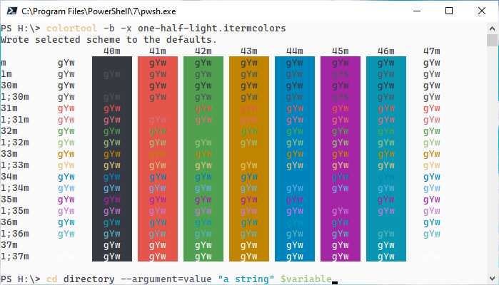
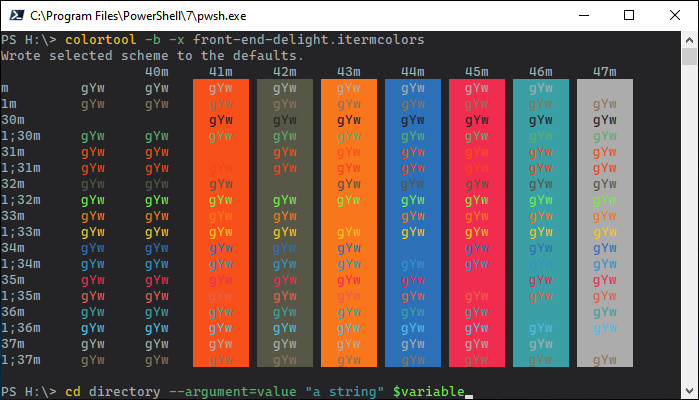
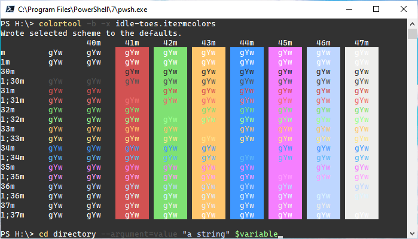
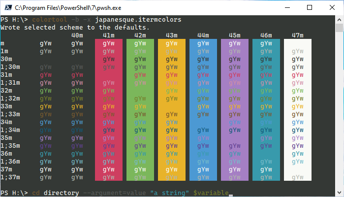
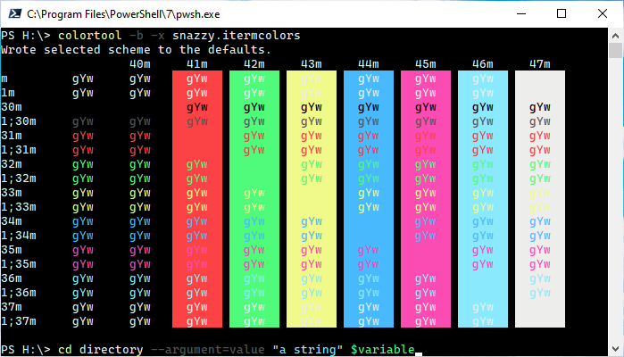
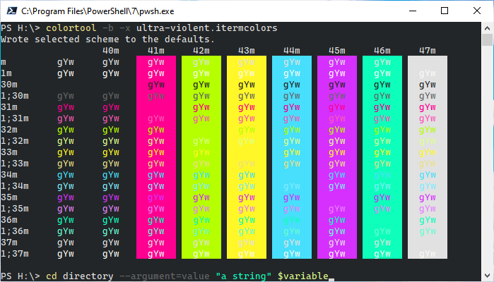
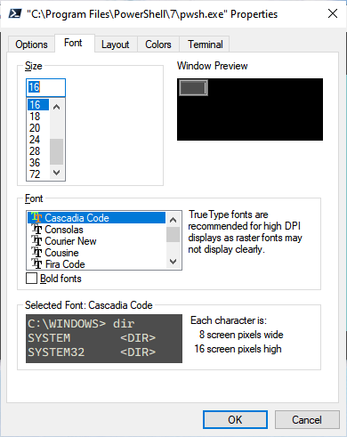

# Color Tool Schemes

[**Contents**](#contents)

A curated collection of schemes compatible with Microsoft's [Color Tool](https://github.com/Microsoft/Terminal/tree/master/src/tools/ColorTool). Schemes derived from the incredible [iTerm2 Color Schemes](https://github.com/mbadolato/iTerm2-Color-Schemes#screenshots) repository.

> [Scheme Credits](https://github.com/mbadolato/iTerm2-Color-Schemes#credits)

Some of the **iTerm2 Color Schemes** have poor / no contrast ratios in PowerShell / Command Prompt, so this list seeks to identify themes that have at least decent contrast ratios.

> If the resulting scheme was iffy in terms of contrast, I decided to keep it.

**Example - Builtin Solarized Dark**

[](./images/_contrast.png)

The sample command at the bottom of the above image reads:

```pwsh
cd directory --argument=value "a string" $variable
```

In some cases, the resulting scheme just flat out doesn't match the source iTerm2 color scheme.

**Example - Chalk**

[](./images/_mismatch.png)

**Source Chalk Scheme**

[](https://github.com/mbadolato/iTerm2-Color-Schemes/raw/master/screenshots/chalk.png)

[Download Color Tool](https://github.com/microsoft/terminal/releases/tag/1904.29002)

## Usage
[Contents](#contents)

Add the [schemes](./schemes) directory to the same location as **ColorTool.exe**, and run:

```pwsh
colortool -b -x {scheme}
```

**example**

```pwsh
colortool -b -x alien-blood.itermcolors
```

> Restart the terminal app for the full scheme to take effect.

> Add the directory containing **ColorTool.exe** to the `PATH` environment variable to execute globally.

## Light Schemes
[Contents](#contents)

### atom-one-light
[Contents](#contents)

[](./images/atom-one-light.png)

### ayu-light
[Contents](#contents)

[](./images/ayu-light.png)

### belafonte-day
[Contents](#contents)

[](./images/belafonte-day.png)

### builtin-solarized-light
[Contents](#contents)

[](./images/builtin-solarized-light.png)

### github
[Contents](#contents)

[](./images/github.png)

### novel
[Contents](#contents)

[](./images/novel.png)

### ocean
[Contents](#contents)

[](./images/ocean.png)

### one-half-light
[Contents](#contents)

[](./images/one-half-light.png)

### piatto-light
[Contents](#contents)

[](./images/piatto-light.png)

### primary
[Contents](#contents)

[](./images/primary.png)

### solarized-light
[Contents](#contents)

[](./images/solarized-light.png)

### spring
[Contents](#contents)

[](./images/spring.png)

### synthwave-everything
[Contents](#contents)

[](./images/synthwave-everything.png)

### tomorrow
[Contents](#contents)

[](./images/tomorrow.png)

### unikitty
[Contents](#contents)

[](./images/unikitty.png)

## Dark Schemes
[Contents](#contents)

### adventure
[Contents](#contents)

[](./images/adventure.png)

### adventure-time
[Contents](#contents)

[](./images/adventure-time.png)

### afterglow
[Contents](#contents)

[](./images/afterglow.png)

### alien-blood
[Contents](#contents)

[](./images/alien-blood.png)

### andromeda
[Contents](#contents)

[](./images/andromeda.png)

### ayu
[Contents](#contents)

[](./images/ayu.png)

### batman
[Contents](#contents)

[](./images/batman.png)

### belafonte-night
[Contents](#contents)

[](./images/belafonte-night.png)

### blueberry-banana
[Contents](#contents)

[](./images/blueberry-banana.png)

### blue-matrix
[Contents](#contents)

[](./images/blue-matrix.png)

### breeze
[Contents](#contents)

[](./images/breeze.png)

### brogrammer
[Contents](#contents)

[](./images/brogrammer.png)

### builtin-dark
[Contents](#contents)

[](./images/builtin-dark.png)

### builtin-pastel-dark
[Contents](#contents)

[](./images/builtin-pastel-dark.png)

### builtin-tango-dark
[Contents](#contents)

[](./images/builtin-tango-dark.png)

### calamity
[Contents](#contents)

[](./images/calamity.png)

### challenger-deep
[Contents](#contents)

[](./images/challenger-deep.png)

### ciapre
[Contents](#contents)

[](./images/ciapre.png)

### cobalt-neon
[Contents](#contents)

[](./images/cobalt-neon.png)

### dark-pastel
[Contents](#contents)

[](./images/dark-pastel.png)

### dark-plus
[Contents](#contents)

[](./images/dark-plus.png)

### deep
[Contents](#contents)

[](./images/deep.png)

### deuteranopia
[Contents](#contents)

[](./images/deuteranopia.png)

### dimmed-monokai
[Contents](#contents)

[](./images/dimmed-monokai.png)

### django-reborn-again
[Contents](#contents)

[](./images/django-reborn-again.png)

### dracula
[Contents](#contents)

[](./images/dracula.png)

### earthsong
[Contents](#contents)

[](./images/earthsong.png)

### encom
[Contents](#contents)

[](./images/encom.png)

### fish-tank
[Contents](#contents)

[](./images/fish-tank.png)

### floraverse
[Contents](#contents)

[](./images/floraverse.png)

### front-end-delight
[Contents](#contents)

[](./images/front-end-delight.png)

### fun-forrest
[Contents](#contents)

[](./images/fun-forrest.png)

### galaxy
[Contents](#contents)

[](./images/galaxy.png)

### grape
[Contents](#contents)

[](./images/grape.png)

### gruvbox-dark
[Contents](#contents)

[](./images/gruvbox-dark.png)

### hardcore
[Contents](#contents)

[](./images/hardcore.png)

### harper
[Contents](#contents)

[](./images/harper.png)

### highway
[Contents](#contents)

[](./images/highway.png)

### hipster-green
[Contents](#contents)

[](./images/hipster-green.png)

### hivacruz
[Contents](#contents)

[](./images/hivacruz.png)

### homebrew
[Contents](#contents)

[](./images/homebrew.png)

### hopscotch.256
[Contents](#contents)

[](./images/hopscotch.256.png)

### ic-orange-ppl
[Contents](#contents)

[](./images/ic-orange-ppl.png)

### idea
[Contents](#contents)

[](./images/idea.png)

### idle-toes
[Contents](#contents)

[](./images/idle-toes.png)

### ir-black
[Contents](#contents)

[](./images/ir-black.png)

### jackie-brown
[Contents](#contents)

[](./images/jackie-brown.png)

### japanesque
[Contents](#contents)

[](./images/japanesque.png)

### jetbrains-darcula
[Contents](#contents)

[](./images/jetbrains-darcula.png)

### konsolas
[Contents](#contents)

[](./images/konsolas.png)

### laser
[Contents](#contents)

[](./images/laser.png)

### later-this-evening
[Contents](#contents)

[](./images/later-this-evening.png)

### lavandula
[Contents](#contents)

[](./images/lavandula.png)

### liquid-carbon-transparent-inverse
[Contents](#contents)

[](./images/liquid-carbon-transparent-inverse.png)

### lovelace
[Contents](#contents)

[](./images/lovelace.png)

### material-dark
[Contents](#contents)

[](./images/material-dark.png)

### mathias
[Contents](#contents)

[](./images/mathias.png)

### medallion
[Contents](#contents)

[](./images/medallion.png)

### mirage
[Contents](#contents)

[](./images/mirage.png)

### molokai
[Contents](#contents)

[](./images/molokai.png)

### mona-lisa
[Contents](#contents)

[](./images/mona-lisa.png)

### monokai-remastered
[Contents](#contents)

[](./images/monokai-remastered.png)

### monokai-soda
[Contents](#contents)

[](./images/monokai-soda.png)

### monokai-vivid
[Contents](#contents)

[](./images/monokai-vivid.png)

### n0tch-2k
[Contents](#contents)

[](./images/n0tch-2k.png)

### nocturnal-winter
[Contents](#contents)

[](./images/nocturnal-winter.png)

### oceanic-material
[Contents](#contents)

[](./images/oceanic-material.png)

### one-half-dark
[Contents](#contents)

[](./images/one-half-dark.png)

### operator-mono-dark
[Contents](#contents)

[](./images/operator-mono-dark.png)

### parasio-dark
[Contents](#contents)

[](./images/parasio-dark.png)

### paul-millr
[Contents](#contents)

[](./images/paul-millr.png)

### pencil-dark
[Contents](#contents)

[](./images/pencil-dark.png)

### pro
[Contents](#contents)

[](./images/pro.png)

### rebecca
[Contents](#contents)

[](./images/rebecca.png)

### red-planet
[Contents](#contents)

[](./images/red-planet.png)

### ripped-casts
[Contents](#contents)

[](./images/ripped-casts.png)

### ryuuko
[Contents](#contents)

[](./images/ryuuko.png)

### sakura
[Contents](#contents)

[](./images/sakura.png)

### scarlet-protocol
[Contents](#contents)

[](./images/scarlet-protocol.png)

### shaman
[Contents](#contents)

[](./images/shaman.png)

### slate
[Contents](#contents)

[](./images/slate.png)

### smyck
[Contents](#contents)

[](./images/smyck.png)

### snazzy
[Contents](#contents)

[](./images/snazzy.png)

### soft-server
[Contents](#contents)

[](./images/soft-server.png)

### solarized-dark
[Contents](#contents)

[](./images/solarized-dark.png)

### solarized-dark-higher-contrast
[Contents](#contents)

[](./images/solarized-dark-higher-contrast.png)

### spacegray-eighties
[Contents](#contents)

[](./images/spacegray-eighties.png)

### spacegray-eighties-dull
[Contents](#contents)

[](./images/spacegray-eighties-dull.png)

### spiderman
[Contents](#contents)

[](./images/spiderman.png)

### sundried
[Contents](#contents)

[](./images/sundried.png)

### thayer-bright
[Contents](#contents)

[](./images/thayer-bright.png)

### the-hulk
[Contents](#contents)

[](./images/the-hulk.png)

### tinacious-design-dark
[Contents](#contents)

[](./images/tinacious-design-dark.png)

### tomorrow-night-burns
[Contents](#contents)

[](./images/tomorrow-night-burns.png)

### toy-chest
[Contents](#contents)

[](./images/toy-chest.png)

### treehouse
[Contents](#contents)

[](./images/treehouse.png)

### ultra-violent
[Contents](#contents)

[](./images/ultra-violent.png)

### under-the-sea
[Contents](#contents)

[](./images/under-the-sea.png)

### urple
[Contents](#contents)

[](./images/urple.png)

### vaughn
[Contents](#contents)

[](./images/vaughn.png)

### warm-neon
[Contents](#contents)

[](./images/warm-neon.png)

### wez
[Contents](#contents)

[](./images/wez.png)

### wild-cherry
[Contents](#contents)

[](./images/wild-cherry.png)

### wombat
[Contents](#contents)

[](./images/wombat.png)

### zenburn
[Contents](#contents)

[](./images/zenburn.png)

## Terminal Screenshot Properties
[Contents](#contents)

[](./images/_props-font.png)

> Get [Cascadia Code](https://github.com/microsoft/cascadia-code/releases)

[](./images/_props-layout.png)

## Contents

[Back to Top](#color-tool-schemes)

* [Usage](#usage)
* [Light Schemes](#light-schemes)
    * [atom-one-light](#atom-one-light)
    * [ayu-light](#ayu-light)
    * [belafonte-day](#belafonte-day)
    * [builtin-solarized-light](#builtin-solarized-light)
    * [github](#github)
    * [novel](#novel)
    * [ocean](#ocean)
    * [one-half-light](#one-half-light)
    * [piatto-light](#piatto-light)
    * [primary](#primary)
    * [solarized-light](#solarized-light)
    * [spring](#spring)
    * [synthwave-everything](#synthwave-everything)
    * [tomorrow](#tomorrow)
    * [unikitty](#unikitty)
* [Dark Schemes](#dark-schemes)
    * [adventure](#adventure)
    * [adventure-time](#adventure-time)
    * [afterglow](#afterglow)
    * [alien-blood](#alien-blood)
    * [andromeda](#andromeda)
    * [ayu](#ayu)
    * [batman](#batman)
    * [belafonte-night](#belafonte-night)
    * [blueberry-banana](#blueberry-banana)
    * [blue-matrix](#blue-matrix)
    * [breeze](#breeze)
    * [brogrammer](#brogrammer)
    * [builtin-dark](#builtin-dark)
    * [builtin-pastel-dark](#builtin-pastel-dark)
    * [builtin-tango-dark](#builtin-tango-dark)
    * [calamity](#calamity)
    * [challenger-deep](#challenger-deep)
    * [ciapre](#ciapre)
    * [cobalt-neon](#cobalt-neon)
    * [dark-pastel](#dark-pastel)
    * [dark-plus](#dark-plus)
    * [deep](#deep)
    * [deuteranopia](#deuteranopia)
    * [dimmed-monokai](#dimmed-monokai)
    * [django-reborn-again](#django-reborn-again)
    * [dracula](#dracula)
    * [earthsong](#earthsong)
    * [encom](#encom)
    * [fish-tank](#fish-tank)
    * [floraverse](#floraverse)
    * [front-end-delight](#front-end-delight)
    * [fun-forrest](#fun-forrest)
    * [galaxy](#galaxy)
    * [grape](#grape)
    * [gruvbox-dark](#gruvbox-dark)
    * [hardcore](#hardcore)
    * [harper](#harper)
    * [highway](#highway)
    * [hipster-green](#hipster-green)
    * [hivacruz](#hivacruz)
    * [homebrew](#homebrew)
    * [hopscotch.256](#hopscotch.256)
    * [ic-orange-ppl](#ic-orange-ppl)
    * [idea](#idea)
    * [idle-toes](#idle-toes)
    * [ir-black](#ir-black)
    * [jackie-brown](#jackie-brown)
    * [japanesque](#japanesque)
    * [jetbrains-darcula](#jetbrains-darcula)
    * [konsolas](#konsolas)
    * [laser](#laser)
    * [later-this-evening](#later-this-evening)
    * [lavandula](#lavandula)
    * [liquid-carbon-transparent-inverse](#liquid-carbon-transparent-inverse)
    * [lovelace](#lovelace)
    * [material-dark](#material-dark)
    * [mathias](#mathias)
    * [medallion](#medallion)
    * [mirage](#mirage)
    * [molokai](#molokai)
    * [mona-lisa](#mona-lisa)
    * [monokai-remastered](#monokai-remastered)
    * [monokai-soda](#monokai-soda)
    * [monokai-vivid](#monokai-vivid)
    * [n0tch-2k](#n0tch-2k)
    * [nocturnal-winter](#nocturnal-winter)
    * [oceanic-material](#oceanic-material)
    * [one-half-dark](#one-half-dark)
    * [operator-mono-dark](#operator-mono-dark)
    * [parasio-dark](#parasio-dark)
    * [paul-millr](#paul-millr)
    * [pencil-dark](#pencil-dark)
    * [pro](#pro)
    * [rebecca](#rebecca)
    * [red-planet](#red-planet)
    * [ripped-casts](#ripped-casts)
    * [ryuuko](#ryuuko)
    * [sakura](#sakura)
    * [scarlet-protocol](#scarlet-protocol)
    * [shaman](#shaman)
    * [slate](#slate)
    * [smyck](#smyck)
    * [snazzy](#snazzy)
    * [soft-server](#soft-server)
    * [solarized-dark](#solarized-dark)
    * [solarized-dark-higher-contrast](#solarized-dark-higher-contrast)
    * [spacegray-eighties](#spacegray-eighties)
    * [spacegray-eighties-dull](#spacegray-eighties-dull)
    * [spiderman](#spiderman)
    * [sundried](#sundried)
    * [thayer-bright](#thayer-bright)
    * [the-hulk](#the-hulk)
    * [tinacious-design-dark](#tinacious-design-dark)
    * [tomorrow-night-burns](#tomorrow-night-burns)
    * [toy-chest](#toy-chest)
    * [treehouse](#treehouse)
    * [ultra-violent](#ultra-violent)    
    * [under-the-sea](#under-the-sea)
    * [urple](#urple)
    * [vaughn](#vaughn)
    * [warm-neon](#warm-neon)
    * [wez](#wez)
    * [wild-cherry](#wild-cherry)
    * [wombat](#wombat)
    * [zenburn](#zenburn)
* [Terminal Screenshot Properties](#terminal-screenshot-properties)